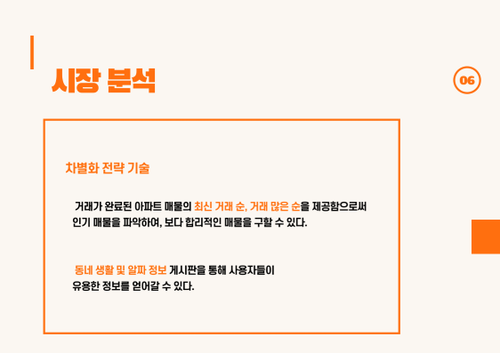
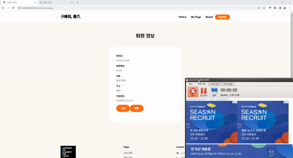

# : 정보를 얻기 힘든 자취 새내기들을 위한 커뮤니티 서비스

# ✔ Project Summary

### 개발 기간 : 2022.09/01 ~ 2022.11/30

### Back-Ground

---

- 집을 알아볼 때 중요하게 여기는 조건들을 **키워드별로 구분**하여, (신축, 층, 평수 대비 가격) 합리적인 아파트 매물 제공
- 정보를 얻기 힘든 자취 새내기들을 위한 **커뮤니티 서비스**
- 집을 알아볼 때 필요한 **알짜 정보**들을 제공

### 시장 분석

---

- **장점** - 다방의 상세 옵션 서비스와 당근 마켓의 동네별 소통 서비스가 존재하여, 편하게 집을 구하고, 동네 정보를 얻을 수 있다.
- **단점** - 두 서비스를 같은 홈페이지에서 이용할 수 없고, 따로 이용해야만 한다.

### 서비스 설명

---

- 거래가 완료된 아파트 매물의 **최신 거래 순, 거래 많은 순**을 제공함으로써 인기 매물을 파악하여, 보다 합리적인 매물을 구할 수 있다.
- **동네 생활 및 알짜 정보** 게시판을 통해 사용자들이 유용한 정보를 얻어갈 수 있다.

### 설계 및 산출물

---

- 클래스 다이어그램

- 화면 흐름도

- 개발환경 및 사용언어

# ✔ Information

# 주요 화면

## 비밀번호 찾기 (브루트포스 알고리즘)

- 가입한 회원정보가 일치하면 랜덤으로 난수 숫자 생성을 하여, 임시 비밀번호를 생성

## 알짜 정보

- Admin만 글 작성, 수정, 삭제가 가능하고, 일반 회원은 글 보기만 가능

## 동네 생활

- 가입한 회원들이 자유롭게 동네 생활을 공유

### 아파트 매매 정보

- 원하는 검색 정보에 따라 아파트 매물 정보 데이터 제공

# 기대 효과

---

- 집을 직접 알아볼 여유가 부족한 사람들을 위해 온라인 상에서 **원하는 조건별로** 매물을 보여준다.
- 관리자가 제공하는 **알짜 정보**를 통해 사용자들이 좋은 매물을 찾아낼 수 있다.
- **동네 생활** 서비스를 통해 집을 구하는 사용자들이 정보를 얻고, 이미 집을 구한 사람들은 주변의 생활 정보를 얻을 수 있다.

# 팀원 소개

- **이승민(팀장) - BackEnd & FrontEnd**
- **하윤영(팀원) - BackEnd & FrontEnd**